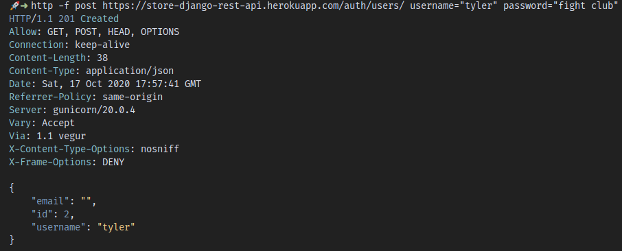
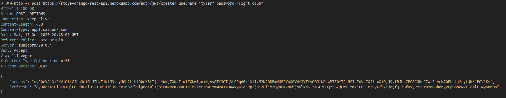
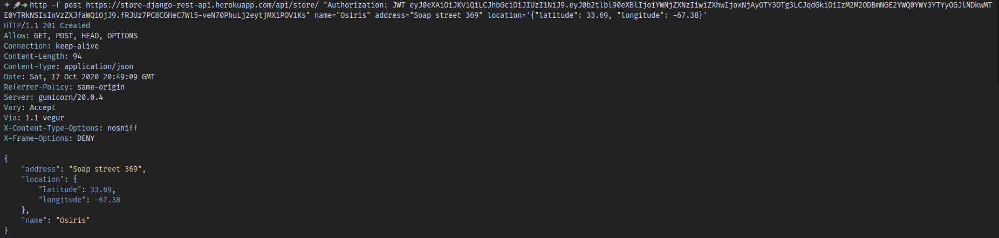
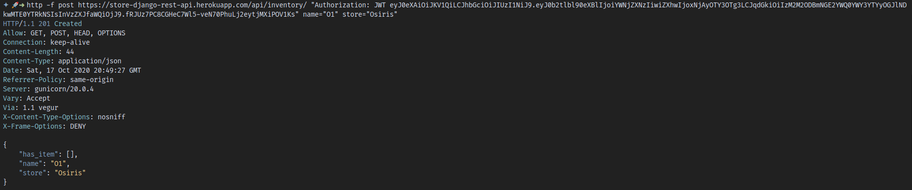
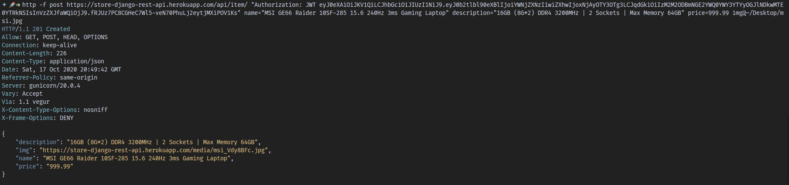
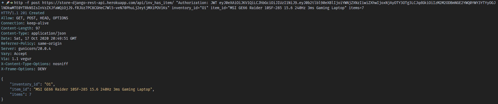

# Store API

This an API for a store made with:

+ django 
+ django rest framework
+ djoser (authentication endpoints)
+ simple jwt (jwt authentication)


## Django Rest Framework 

DRF is a toolkit to make REST APIs and integrates easy with an existing django application. The process of making an API is very similar 
to making a form with django's built in tools. All you have to do is:

1. Install django rest framework
```
$ pip install djangorestframework
```

2. Add to INSTALLED_APPS
```
INSTALLED_APPS = [
    ...,
    "rest_framework"
]
```


3. Create serializers.py file: This is where serializers are created for existing models and new ones are defined.

```
from rest_framework import serializers
from .models import Task


class TaskSerializer(serializers.ModelSerializer):
    class Meta:
        model = Task
        fields = "__all__"
``` 

4. Add the api logic inside views.py or a new one called api.py (recommended).

```
from rest_framework import generics
from .serializers import TaskSerializer

class TaskListAPI(generics.ListCreateAPIView):
    queryset = Task.objects.all()
    serializer_class = TaskSerializer
```


## Set up djoser

With djoser it's easier to authenticate users via database stored tokens or JWT tokens since it provides the urls endpoints 
where different actions can be perfomed as:

+ User
    + create
    + delete 
    + change password
    + ...

+ Token 
    + create
    + refresh
    + verify
    + ...


The tokens can be used to protect API views, in this project I allow unauthenticated GET requests but POST are only allowed 
through the jwt token. 

Just follow this steps:

1. Install


```
$ pip install djoser djangorestframework_simplejwt
```

2. Configure

Add the following content to INSTALLED APPS:

```
INSTALLED_APPS = [
    ...,
    'rest_framework',
    'rest_framework.authtoken',
    'djoser',
    ...
]
```

In project's urls.py file:


```
urlpatterns = [
    ...,
    path('auth/', include('djoser.urls')),
    ...
]
```

To use the JWT authentication method, configure the REST\_FRAMEWORK settings:

```
REST_FRAMEWORK = {
    ...,
    'DEFAULT_PERMISSION_CLASSES': [
        'rest_framework.permissions.IsAuthenticatedOrReadOnly',
    ],
    'DEFAULT_AUTHENTICATION_CLASSES': [
        'rest_framework_simplejwt.authentication.JWTAuthentication'
    ],
    ...
}
```

3. Enable JWT auth headers in settings.py:

```
SIMPLE_JWT = {
    'AUTH_HEADER_TYPES': ['JWT']
}
```

## Testing the auth API

To test the authentication API (djoser) I'll use _http_ command provided by
_httpie_ library. Install it via pip:

```
$ pip install httpie
```

### Creating an user

```
$ http http://127.0.0.1:8000/auth/users/ username="tyler" password="fight club"
```



### Get a JWT token

```
$ http -f post https://store-django-rest-api.herokuapp.com/auth/jwt/create/ username="tyler" password="fight club"
``` 



### Create a store 

```
$ http -f post https://store-django-rest-api.herokuapp.com/api/store/ "Authorization: JWT " name="Osiris" address="Soap street 369" location='{"latitude": 33.69, "longitude": -67.38}'
```



### Add an inventory to that store

```
$ http -f post https://store-django-rest-api.herokuapp.com/api/inventory/ "Authorization: JWT " name="O1" store="Osiris"
```



### Add items to the database

```
$ http -f post https://store-django-rest-api.herokuapp.com/api/item/ "Authorization: JWT " "Content-Type: multipart/form-data" name="MSI GE66 Raider 10SF-285 15.6 240Hz 3ms Gaming Laptop" description="16GB (8G*2) DDR4 3200MHz | 2 Sockets | Max Memory 64GB" price=999.99 img@~/Desktop/msi.jpg
```




### Add the item to the inventory

```
$ http -f post https://store-django-rest-api.herokuapp.com/api/inv_has_item/ "Authorization: JWT " inventory_id="O1" item_id="MSI GE66 Raider 10SF-285 15.6 240Hz 3ms Gaming Laptop" items=7
```

